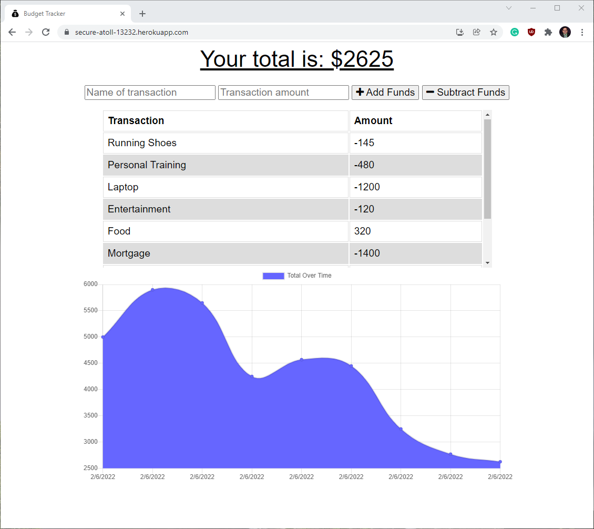

# RVT Budget Tracker
A budget tracking application that uses offline functionality.

## Table of contents
  - [Table of contents](#table-of-contents)
  - [General info](#general-info)
  - [Deployed Application](#deployed-application)
  - [Screenshots](#screenshots)
  - [Setup](#setup)
  - [Code and Technologies](#code-and-technologies)
  - [Licenses](#licenses)
  - [Developer(s)](#developers)

## General info
This application allows you to track your transactions and help plan a budget. The data that is entered offline will be cached and uploaded when a connection is established.

## Deployed Application
[Budget Tracker](https://secure-atoll-13232.herokuapp.com/)

## Screenshots

## Setup
* Clone GitHub repository 
* run npm install
* Run 'npm start' to start the application.

## Code and Technologies
* HTML 
* CSS
* Bootstrap
* JavaScript
* Node.js
* Express.js
* Indexed DB for offline functionality
* Service Worker installed and activated

## Licenses
 
 

## Developer(s)
* [Raman TV.](https://github.com/ramantv)

